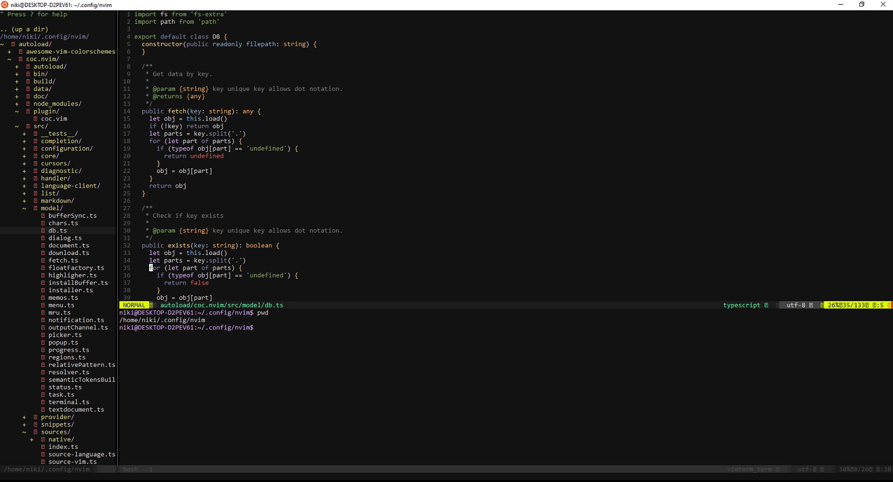
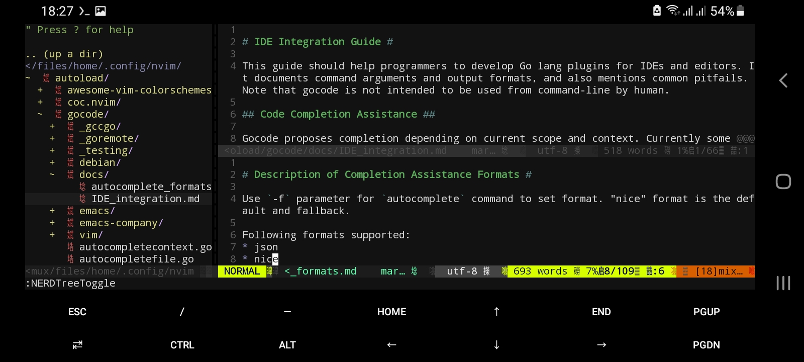

## Vim Config Plugins for Termux (Android)

### Windows(wsl)


### Android (termux)


### Requirement

```sh
$ pkg upgrade
$ pkg install curl
$ pkg install git
$ pkg install python3
$ pkg install python2
$ pkg install nodejs-lts
$ pkg install neovim # in nvim => ($:checkhealth provider) must be ok

```

```sh
# Note if in checkhealth 'pynvim is not installed'
$ python3 -m pip install --user --upgrade pynvim
```

After Install All Needed Package Do: 
```sh
$ #curl -fLo ~/.config/nvim/autoload/plug.vim --create-dirs \
  #  https://raw.githubusercontent.com/hootan09/vim-termux/main/plug.vim

$ curl -fLo ~/.config/nvim/init.vim --create-dirs \
    https://raw.githubusercontent.com/hootan09/vim-termux/main/init.vim
```

### Other Config(Not Needed for Android)
```sh
# only in wsl(win10)
$ sudo apt-get install curl
$ sudo chmod 751 -R ~/.config #maybe needed chown on win10 wsl
$ sudo curl -o- https://raw.githubusercontent.com/nvm-sh/nvm/v0.38.0/install.sh | bash #install nvm (after install close terminal and reopent it again)
$ command -v nvm # Verify Installation
$ nvm install --lts # Latest stable LTS release (recommended) Or $nvm install node # Current release
```

#### Put in  ~/.config/nvim/init.vim
```vim
set number
" set relativenumber
set autoindent
set tabstop=4
set shiftwidth=4
set smarttab
set softtabstop=4
set mouse=a
set encoding=UTF-8

" Make sure you use single quotes
call plug#begin('~/.config/nvim/autoload')
    
    " Shorthand notation; fetches https://github.com/junegunn/vim-easy-align
    Plug 'junegunn/vim-easy-align'

    " Any valid git URL is allowed
    Plug 'https://github.com/junegunn/vim-github-dashboard.git'

    " Multiple Plug commands can be written in a single line using | separators
    Plug 'SirVer/ultisnips' | Plug 'honza/vim-snippets'

    " On-demand loading
    Plug 'scrooloose/nerdtree', { 'on':  'NERDTreeToggle' }
    Plug 'tpope/vim-fireplace', { 'for': 'clojure' }

    " Using a non-default branch
    Plug 'rdnetto/YCM-Generator', { 'branch': 'stable' }

    " Using a tagged release; wildcard allowed (requires git 1.9.2 or above)
    Plug 'fatih/vim-go', { 'tag': '*' }

    " Plugin options
    Plug 'nsf/gocode', { 'tag': 'v.20150303', 'rtp': 'vim' }

    " Plugin outside ~/.vim/plugged with post-update hook
    Plug 'junegunn/fzf', { 'dir': '~/.fzf', 'do': './install --all' }

    " Unmanaged plugin (manually installed and updated)
    Plug '~/my-prototype-plugin'

    " Surrounding ysw)
    Plug 'http://github.com/tpope/vim-surround' 

    " NerdTree
    Plug 'https://github.com/preservim/nerdtree' 
    
    " For Commenting gcc & gc
    Plug 'https://github.com/tpope/vim-commentary' 

    " Status bar
    Plug 'https://github.com/vim-airline/vim-airline' 

    " PSQL Pluging needs :SQLSetType pgsql.vim
    "  -  Plug 'https://github.com/lifepillar/pgsql.vim' 
    
    " CSS Color Preview
    "  -  Plug 'https://github.com/ap/vim-css-color' 

    " Retro Scheme
    Plug 'https://github.com/rafi/awesome-vim-colorschemes' 

    " Auto Completion, Only Available in NeoVim (Not Vim), Needed Nodejs for Build Plugin
    Plug 'https://github.com/neoclide/coc.nvim'

    " Developer Icons
    Plug 'https://github.com/ryanoasis/vim-devicons' 

    " Vim Terminal
    Plug 'https://github.com/tc50cal/vim-terminal' 
    
    " Tagbar for code navigation
    Plug 'https://github.com/preservim/tagbar' 
    " For this Plugin Need $sudo apt install exuberant-ctags

    " CTRL + N for multiple cursors
    Plug 'https://github.com/terryma/vim-multiple-cursors' 

" Initialize plugin system
call plug#end()

colorscheme jellybeans

nnoremap <C-f> :NERDTreeFocus<CR>
nnoremap <C-n> :NERDTree<CR>
nnoremap <C-t> :NERDTreeToggle<CR>
nnoremap <C-l> :call CocActionAsync('jumpDefinition')<CR>

nmap <F8> :TagbarToggle<CR>
" For No Previews
set completeopt-=preview 

let g:NERDTreeDirArrowExpandable="+"
let g:NERDTreeDirArrowCollapsible="~"

"--- Just Some Notes ---
    " :PlugClean :PlugInstall :UpdateRemotePlugins
    "
    " :CocInstall coc-python
    " :CocInstall coc-clangd
    " :CocInstall coc-snippets
    " :CocCommand snippets.edit... FOR EACH FILE TYPE

" air-line
let g:airline_powerline_fonts = 1

if !exists('g:airline_symbols')
    let g:airline_symbols = {}
endif

" airline symbols
let g:airline_left_sep = ''
let g:airline_left_alt_sep = ''
let g:airline_right_sep = ''
let g:airline_right_alt_sep = ''
let g:airline_symbols.branch = ''
let g:airline_symbols.readonly = ''
let g:airline_symbols.linenr = ''

inoremap <expr> <Tab> pumvisible() ? coc#_select_confirm() : "<Tab>"
```


### Install Plugins
```vim
:PlugInstall
```


### Some Plugins Requirements
```sh
#Tagbar Plugin https://github.com/preservim/tagbar
$sudo apt install exuberant-ctags

#----------------------------------------------------------------------------------

# coc Plugin https://github.com/neoclide/coc.nvim (Needed Nodejs For Build Plugin)
$ cd ~/.config/nvim/autoload/coc.nvim
$ npm install
$ npm run build
$ nvim # For Python3 :CocInstall coc-pyright


# Old Python with jedi
#$ nvim # <:CocInstall coc-python > note for python need install jedi $python3 -m pip --user --upgrade jedi

# For generic web-development consider :CocInstall coc-tsserver coc-json coc-html coc-css

# For Python3 :CocInstall coc-pyright

# For PHP :CocInstall coc-phpls

# List of All Extension :CocList extensions
# Document https://github.com/neoclide/coc.nvim/wiki/Using-coc-extensions
```


#### ShortCuts Key
```vim
gg "=> Go to the First Line
G  "=> Go to the Last Line
v  "=> Visuall Mode (for Selecting)
I  "=> Go to Begining Line
A  "=> Go to End of Line
dd "=> Delete Line
o  "=> Open New Line (Bellow)
O  "=> Open New Line (Above)
y  "=> Copy
p  "=> Paste

gcc "=> Comments/Uncomments

F8 "=> Toggle TagBars

Ctrl + f "=> NERDTree Focus
Ctrl + t "=> NERDTree Toggle

:TerminalSplit bash "=> Open bash Terminal

:/<Search Word in Document> "=> n (Find Next in Bellow ) N (Find Next in Above)

```
